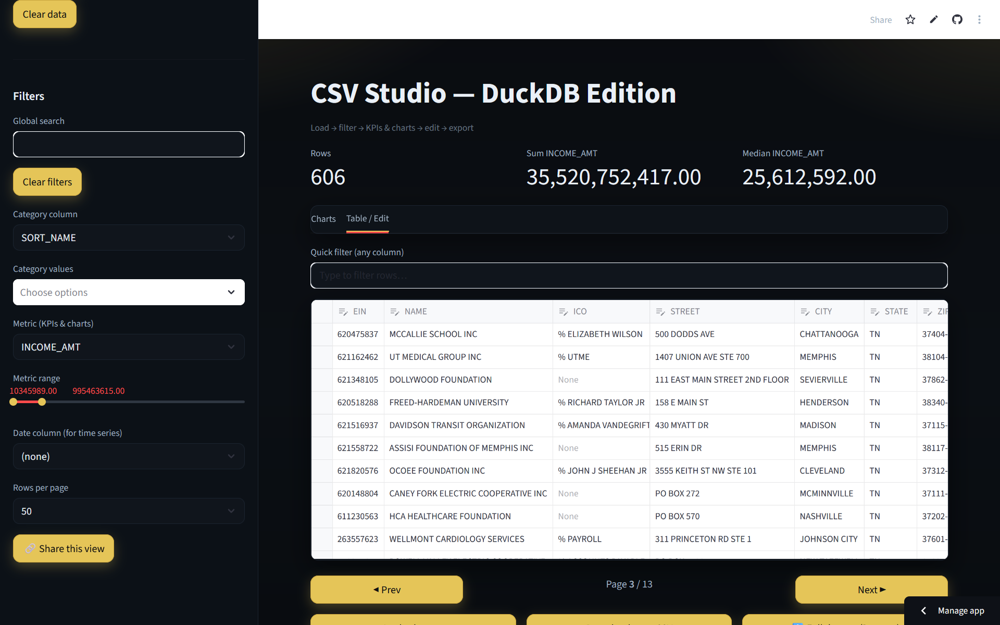

# CSV Studio — DuckDB Edition

[](https://csv-studio-duckdb.streamlit.app/)


[](LICENSE)

A compact, browser-based **CSV workbench**. Upload a file or paste a CSV URL, filter + chart it, **edit rows**, and export—fast.

<p align="center">
  <a href="https://csv-studio-duckdb.streamlit.app/">Live demo</a> ·
  <a href="https://github.com/xXBricksquadXx/csv-studio-duckdb">Source</a>
</p>

<!-- Optional: add a repo/social preview image -->
<p align="center">
  
</p>

---

[](https://github.com/xXBricksquadXx/csv-studio-duckdb/generate)

### After you click “Use this template”

- `python -m venv .venv && .\.venv\Scripts\Activate.ps1`
- `pip install -r requirements.txt`
- `python -m streamlit run app.py`
- (Optional) tweak theme in `.streamlit/config.toml` and the app title in `app.py`

---

## Capabilities

- **Load** CSV/TSV/XLSX or **fetch** a public CSV by URL
- **Filter & search:** text, category, date range, global search, metric range
- **KPIs & charts:** sum/median, **time series** (date+metric), **by category** (metric by dimension)
- **CRUD editor:** add / update / delete rows (safe internal `_id`)
- **Sort & paginate** large tables (25/50/100/250/1000 rows)
- **Export** page CSV, filtered CSV, or full dataset
- **One-click resets:** clear filters, clear data, reset app

---

## Quickstart

```bash
# 1) Create & activate a venv (Windows PowerShell)
python -m venv .venv
.\.venv\Scripts\Activate.ps1

# 2) Install
pip install -r requirements.txt  # includes streamlit, duckdb, pandas, plotly, openpyxl

# 3) Run
python -m streamlit run app.py
```
